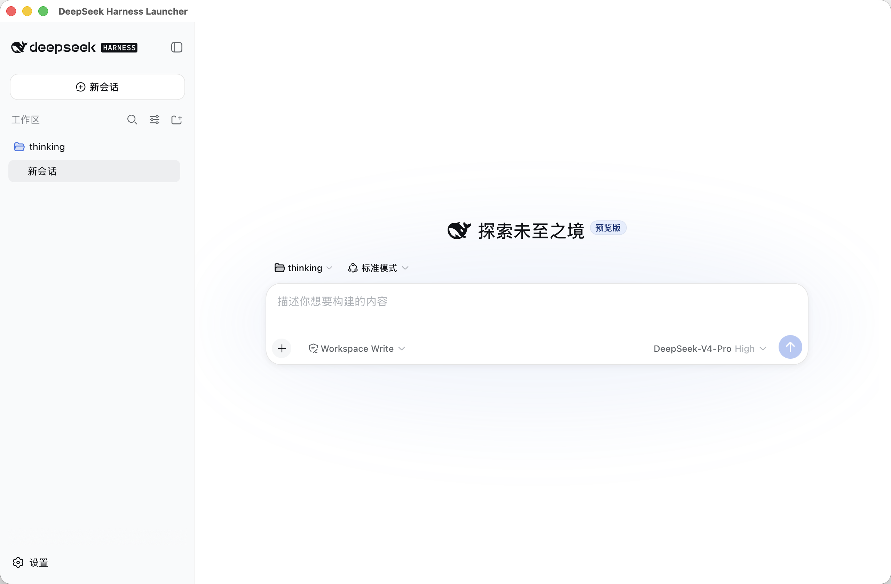

# DeepSeek Harness Launcher

## From opening the app to getting work done

DeepSeek Harness Launcher is the desktop entry point for DeepSeek Harness. It brings the runtime environment, version management, and local startup flow together, so you can open the app and enter your workspace without configuring Node, dsh, or other runtime dependencies first.

<p align="center">
  <picture>
    <source media="(prefers-color-scheme: dark)" srcset="./docs/image-black.png" />
    <source media="(prefers-color-scheme: light)" srcset="./docs/image.png" />
    
  </picture>
</p>

## Core features

### Automatic environment setup

On first launch, the app downloads the matching Node runtime and installs dsh for DeepSeek Harness. All runtime files are managed in the app's own directory, without changing your system environment or affecting existing projects.

### Open directly into Harness

Once the environment is ready, the app starts the local service and opens DeepSeek Harness in the main window. Create sessions, choose a workspace and mode, and start working immediately.

### Updates stay in your control

When a new dsh version is available, the app only shows a notification. It will not switch versions while you are working. The download, verification, switch, and restart happen only after you confirm the update.

### Automatic recovery after startup failure

If a new version fails to start, the app automatically returns to the last verified working version, reducing the impact of an update failure.

## Installation and first use

1. Visit [Releases](https://github.com/shetengteng/deepseek-harness-launcher/releases) and download the package for your system.
2. On macOS, choose the package for your chip:
   - Apple Silicon: `arm64` / `aarch64`
   - Intel: `x64`
3. On macOS, open the `.dmg` and drag the app to Applications. On Windows and Linux, complete the installation using the corresponding package.
4. Keep an internet connection available on first launch. The app will download Node and dsh, then open Harness when setup is complete.

### Additional macOS step

The current macOS package has not been notarized by Apple. On first launch, macOS may show “The application is damaged” or “cannot verify the developer.” This is macOS blocking an unnotarized app; it does not mean that the application file is damaged.

After moving the app to Applications, open Terminal and run:

```bash
xattr -cr /Applications/deepseek-harness-launcher.app
```

Then open the app again. If macOS still blocks it, Control-click the app icon and choose “Open.”
