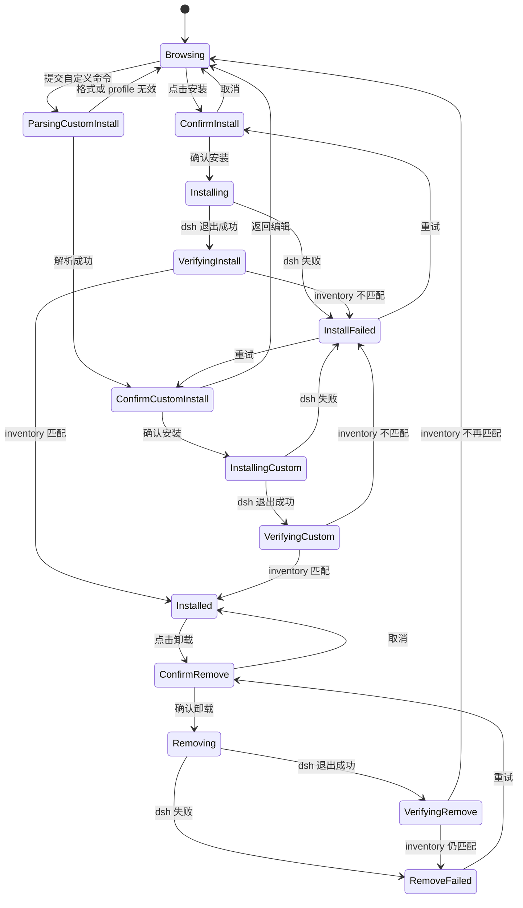

# Launcher 插件市场设计

## 1. 目标与边界

本设计为 `deepseek-harness-launcher` 增加一个位于**全屏设置页**中的插件市场。用户可以搜索目录、查看来源与风险信息、从目录安装或输入受支持的 dsh 插件命令安装到指定 profile，以及卸载已安装插件；设置页占用当前 Launcher 主界面，用户可随时返回 dsh Web UI。

市场是一个受控的**目录与安装入口**，不是安全背书，也不执行目录提供方返回的任意命令。

### 目标

- 在一个完整的设置页内完成查找、目录安装、自定义安装和卸载，不要求用户理解 npm、Git URL 或 dsh profile 的内部文件结构。
- 默认使用可缓存的公开目录 API；断网时仍可浏览上次成功同步的目录并准确展示其过期状态。
- 所有安装和卸载都由 Launcher 使用托管的 dsh 运行时执行，且由本地 profile 的真实状态决定最终结果。
- 让用户在执行前看清仓库、固定引用、目标 profile 和 dsh 将运行的动作。

### 非目标

- 不在第一期维护自有的 GitHub 爬虫、Cloudflare D1 或安装统计服务。
- 不将目录中的静态格式校验视为代码审计、恶意代码检测或来源担保。
- 不安装 Node 依赖、不执行目录中的 shell 命令，也不解析或运行插件仓库代码来获得详情。
- 不把“自定义安装”做成任意 shell 或可复制粘贴脚本的执行入口；输入中的 source 始终作为单个 dsh 参数传递。
- 不改变 dsh 的插件格式、依赖解析规则或 profile 存储格式。
- 不自动安装、更新或移除插件。

## 2. 产品决策

### 2.1 市场的位置

设置页保留简洁的左侧导航：以“设置”作为设置域标题，当前只展示一个可用子页“插件”。不提前放入“运行时”“诊断”等未完成页面。右侧为插件市场的固定双栏工作区：

```text
Launcher 主界面
├── dsh Web UI
└── 全屏设置页
    ├── 顶部栏：产品标识、当前 dsh 版本、返回 dsh
    └── 设置工作区
        ├── 左侧导航：设置 / 插件（当前）
        └── 插件页
            ├── 市场顶部栏：标题、目录新鲜度、市场 / 已安装 Tabs
            └── 双栏：搜索、筛选、其下的自定义安装文本按钮与目录结果列表 / 选中插件或自定义命令的详情与操作区
```

设置通过主界面路由切换，不创建第二个 WebviewWindow、不使用系统对话框，也不从 dsh Web UI 上叠抽屉。用户打开设置时是在做维护工作，因此检索、来源判断和确认安装应在同一处完成。

顶部栏的“返回 dsh”是明确的一级操作：它回到当前已运行的 dsh Web UI，不会终止 dsh 子进程。返回前保持当前市场的搜索条件、列表滚动位置和选中插件；再次进入设置时恢复这些上下文。浏览器历史 Back 不参与该行为，避免与 dsh Web UI 内部导航混淆。

安装和卸载的确认也在详情区**内联展开**，不叠加二次模态框。这样操作上下文、目标 profile 与仓库信息始终可见。

运行时和诊断不是凑数功能：现有产品已支持 Node/dsh 版本、更新源、日志与诊断导出。但它们尚未有对应的全屏页面信息架构，因此本设计不在左侧导航中放置不可用入口，也不删除这些既有能力。等各自页面完成设计后，再作为“设置”下的可用子页引入。

### 2.2 默认目录提供方

第一期通过 `MarketplaceProvider` 接入公开目录 API。默认实现为 DSH 1024Store 兼容适配器，访问其公开检索和目录快照端点；实现不得让 UI、状态管理或安装逻辑依赖某一家 API 的响应形状。

Provider 只可返回标准化的目录记录，不能返回可执行命令：

```ts
type CatalogPlugin = {
  id: string // owner/repository 或 owner/repository/subdir
  name: string
  repositoryUrl: string // 仅允许 https://github.com/<owner>/<repo>
  installSpec: {
    owner: string
    repository: string
    subdirectory?: string
    ref?: string
  }
  description: string
  category: string | null
  tags: string[]
  sourceUpdatedAt: string | null
  validatedAt: string | null
  popularity: {
    marketplaceRank: number | null // provider 排名，1 为最高；无数据时为 null
    rankingUpdatedAt: string | null
    githubStars: number | null
    starsFetchedAt: string | null
  }
}
```

适配器要对外部数据再验证一次：ID、GitHub owner/repository、可选子目录和 ref 均使用严格的长度与字符集限制；`repositoryUrl` 必须由 `installSpec` 自行构造。展示文案为纯文本，绝不渲染为 HTML。

`marketplaceRank` 与 `githubStars` 是不同口径：前者是 provider 公布的市场榜单名次，后者是 GitHub 仓库 Star 快照。UI 必须分别标注，不能用某个未经说明的“热度分数”替代二者。Provider 不提供排名或 Star 时，返回 `null` 并在界面显示“目录未提供”，不猜测或从缓存的旧值补写为实时数据。

接口默认地址属于构建时常量和 allowlist，不放在普通设置中。若将来提供自建市场，只允许通过编译配置或受控企业策略替换 provider，避免用户把 Launcher 变成任意远程安装器。

### 2.3 缓存与目录新鲜度

目录缓存写入 `<data_dir>/marketplace/catalog-cache-v1.json`，而不是新增数据库。缓存包含 provider 标识、ETag（如果有）、成功获取时间、原始响应版本和规范化条目；失败响应及不完整响应不覆盖缓存。

| 场景 | 行为 |
| --- | --- |
| 首次打开且有网络 | 立即显示骨架屏，请求目录；成功后写缓存。 |
| 缓存未满 24 小时 | 先显示缓存，在后台条件刷新。 |
| 缓存超过 24 小时 | 显示缓存与“目录可能已过期”，由用户点击刷新。 |
| 无缓存且请求失败 | 显示不可安装的空状态和“重试”按钮。 |
| 用户点击“刷新目录” | 显示按钮内进度；保留当前结果直到新结果成功替换。 |

页面只展示“已同步于/可能已过期”，不虚构实时性。刷新是目录行为，不会检查或改变本地已安装插件。

## 3. 信息架构与交互

### 3.1 搜索与过滤

搜索框支持名称、仓库 ID、描述、标签的本地过滤；目录服务提供搜索时可同时请求服务端结果，但界面不依赖网络往返才能过滤已缓存项目。搜索为空时显示推荐排序，非空时显示匹配排序。

全屏设置页顶部采用与 IntelliJ IDEA 插件页一致的两项 `Tabs`，控制下方整个双栏工作区的内容范围：

- **市场**：默认页，展示目录中的全部插件，并保留“已安装”状态；
- **已安装**：只展示当前 profile 的本地 inventory，标签显示已安装数量。即使插件已不在当前目录中，也要以“本地插件”条目展示，避免用户失去卸载入口。

Tab 是范围切换，不是复选框筛选。切换后保留搜索、分类、排名范围、Star 门槛和排序条件；空的“已安装”页说明当前 profile 没有已安装插件。

可见过滤项：

- 分类下拉框，默认“全部分类”；
- 榜单范围，默认“全部排名”，可过滤“Top 100”或“Top 500”；
- GitHub Stars 门槛，默认“不限”，可过滤“100+”或“250+”；
- 排序，默认“市场排名”，可选择“相关性”“GitHub Stars”或“最近更新”；
- 当前 dsh profile，下拉框默认 `web`。

分类、排序、榜单范围与 GitHub Stars 门槛在桌面宽度下固定为同一行的四个等宽控件；宽度不足时才折为两列，避免压缩标签或点击目标。

“已安装” Tab 的判断来自本地 profile 的真实依赖状态，不来自目录服务。目录中不存在但已经安装的插件，在该 Tab 中仍应出现为“本地插件”，并提示它未被当前目录收录。

### 3.2 结果列表

每项只展示支持快速判断的内容：市场排名、名称、仓库 ID、简短描述、GitHub Star 数、分类、最近更新时间和本地状态。排名使用 `#8` 这类清晰数字，放在名称前的 `Badge` 中；Star 使用图标加文字（例如“★ 312 Stars”），放在底部元信息中且紧邻更新时间之前。两者均不能只靠颜色表达。

未排名的条目保留在“全部排名”结果中，在排名位置显示“未上榜”；当用户启用 Top 范围过滤时，未排名条目不显示。Star 缺失的条目不满足任何 Star 门槛，但仍可在“不限”时显示。

| 本地状态 | 文案 | 含义 |
| --- | --- | --- |
| `available` | 可安装 | 当前 profile 未解析到该插件。 |
| `installed` | 已安装 | profile 中已解析到匹配的安装 spec。 |
| `update_available` | 有可用更新 | 目录提供的 ref 与已安装 ref 可比较且不同。 |
| `unknown` | 状态待确认 | profile 读取或匹配失败，禁止执行安装/卸载。 |
| `operation_running` | 正在处理 | 当前 Launcher 操作进行中，其他操作禁用。 |

点击一项仅更新详情区，不触发安装。键盘上下键移动列表焦点，Enter 打开详情，`⌘/Ctrl + K` 聚焦搜索框。

### 3.3 详情与安装

详情区固定展示：描述、GitHub 仓库链接、目录分类与标签、目录最后更新时间、静态校验时间（若 provider 提供）、目标 profile 和安装来源。信息不足时直说“目录未提供”。

目录信息中另外显示“市场排名”和“GitHub Stars”，各自附带数据更新时间。排名用于浏览目录，不能影响安装安全判断，也不作为推荐或安全等级的暗示。

首次点“安装”后，详情底部展开确认区：

```text
将安装到 profile：web
来源：github:owner/repository#path:optional/subdir
执行者：Launcher 托管的 dsh <version>

[取消]  [确认安装]
```

确认后执行过程在同一区域展示为“准备中 → 正在安装 → 正在核验 → 已安装/失败”。成功时重新读取 profile，只有读取结果匹配预期 spec 才将状态写为“已安装”。失败时保留 dsh 的已净化错误摘要、日志文件位置和“重试”按钮；不得猜测安装是否成功。

安装指令由 Rust 后端从经过验证的 `installSpec` 生成，前端不拼接 shell 字符串。语义等价于：

```text
<managed dsh> plugin --profile <profile> add github:<owner>/<repository>[#path:<subdirectory>]
```

具体命令参数由当前 dsh 版本的受控适配器生成。Launcher 将其 stdout/stderr 写入自身 dsh 子进程日志，UI 只读取长度受限、去除控制字符的进度摘要。

### 3.4 自定义安装

“市场”Tab 的筛选器下方提供默认收起的 `+ 自定义安装` 文本按钮。它面向低频的已知来源安装，不与搜索和常用筛选争夺视觉权重；点击后才在原位展开命令输入和“继续”按钮。展开状态由用户保留到离开市场 Tab，正在解析、确认、安装或显示错误时不得自动收起。输入框显示受支持格式的占位示例：

```text
dsh plugin --profile web add <source>
```

用户可输入当前 dsh `plugin add` 支持的任意来源形式。点击“继续”或在输入框按 Enter 后，前端仅做即时格式提示；真正的解析和校验必须由 Rust 后端完成。受支持格式是单条、无引号的 dsh 添加命令：

- 命令前缀固定为 `dsh plugin --profile <profile> add`，`profile` 必须是 Launcher 当前可用的 profile 名称；
- `<source>` 必须是单个无空白参数。Launcher 不枚举、转换或限制其 scheme、仓库、注册表、URL 或本地来源，具体语义由当前 dsh 处理；
- 后端仅做命令结构与安全字符校验，拒绝控制字符、引号、额外 flag、重定向、管道和环境变量，并将 source 作为一个独立 argv 参数传递；
- 输入中的 dsh 二进制名只表示此受控语法，Launcher 不读取 PATH，也不执行用户输入的字符串。

解析通过后，详情区切换为“自定义安装”预览。它明确显示目标 profile、原样保留的 source spec、Launcher 托管的 dsh 版本，以及“此来源未经过市场目录校验”的风险提示。用户仍需点“确认安装”；后端从已验证的结构化字段重新构造参数数组，而不是将原始命令传给 shell 或子进程。

```text
自定义来源，尚未执行
将安装到 profile：web
来源：<source>
执行者：Launcher 托管的 dsh <version>

[返回编辑]  [确认安装]
```

成功后重新读取 profile。若 inventory 匹配，该项在“已安装”Tab 显示为“本地插件”，并标注“未被当前目录收录”；若未匹配或命令失败，保持保守的未确认状态，并显示已净化错误摘要、日志路径和“重试”。自定义来源不会写入目录缓存，也不会在“市场”Tab 伪装成目录条目。

### 3.5 卸载

只有 `installed` 或 `update_available` 状态显示“卸载”。按钮第一次点击后在详情区展开高风险确认区，明确写出被移除的本地安装 spec 与 profile；第二次“确认卸载”才调用 dsh。

卸载必须使用读取到的**已安装 spec**，不能使用目录当前返回的 URL，也不能为未在本地解析到的包猜测删除目标。成功后重新读取 profile 确认该 spec 已消失；失败时保持“已安装”状态并给出重试和日志入口。

### 3.6 风险信息

详情区底部常驻一段紧凑说明：

> 目录校验插件结构，不代表代码安全。安装前请确认仓库来源；插件可在 dsh 中执行其声明的能力。

当 `validatedAt` 缺失、目录缓存过期、仓库为首次见到、或 plugin 记录包含子目录时，显示对应的文字提示。它们不必然阻止安装，但用户必须能在确认区看到原因。

## 4. 后端架构

### 4.1 模块职责

```text
src-tauri/src/marketplace/
├── mod.rs                 命令与模块导出
├── provider.rs            MarketplaceProvider trait、响应规范化和 allowlist
├── dsh1024_provider.rs    默认公开目录 API 适配器
├── cache.rs               原子缓存读写、ETag 与过期策略
├── catalog.rs             查询、排序、目录与本地状态合并
├── install.rs             目录 spec / 自定义命令解析、受控 dsh 调用、结果核验
├── inventory.rs           从 profile 读取已安装插件的权威快照
└── types.rs               前后端共享的序列化模型
```

市场模块只通过已存在的 Node/dsh 管理模块取得可用 dsh 入口，并复用 host 日志与单进程操作锁。它不得直接调用系统 `node`、系统 `dsh`、shell 或 `npm`。

### 4.2 Tauri 命令面

```ts
type MarketplaceQuery = {
  query?: string
  category?: string
  installedOnly?: boolean
  sort: 'relevance' | 'updated' | 'popularity'
  profile: string
}

type MarketplaceSnapshot = {
  source: { label: string; fetchedAt: string | null; stale: boolean }
  plugins: MarketplacePlugin[]
  profiles: string[]
}

type MarketplaceOperation = {
  id: string
  kind: 'install' | 'custom_install' | 'remove'
  pluginId: string
  profile: string
  phase: 'preparing' | 'running' | 'verifying' | 'succeeded' | 'failed'
  message: string
  logPath: string | null
}

type MarketplaceCustomInstallRequest = {
  command: string
}

invoke('marketplace_query', query): Promise<MarketplaceSnapshot>
invoke('marketplace_refresh'): Promise<MarketplaceSnapshot>
invoke('marketplace_install', { pluginId, profile }): Promise<MarketplaceOperation>
invoke('marketplace_install_custom', request: MarketplaceCustomInstallRequest): Promise<MarketplaceOperation>
invoke('marketplace_remove', { installationId, profile }): Promise<MarketplaceOperation>
```

`marketplace_install` 仅接收目录 ID 和 profile。后端先从当前已验证的目录快照找到记录，再构造 spec，因此 UI 传入的展示字段无法影响实际命令。`marketplace_install_custom` 只把输入作为待解析文本，不执行它：后端先按 3.4 的固定命令结构解析为 profile 与单个 source spec，核验 profile 存在后，使用结构化字段重建 dsh 参数数组。`marketplace_remove` 接收 inventory 产生的 installation ID，不接收路径、URL 或包名。

进度以 Tauri event `marketplace://operation` 推送。整个应用同一时刻只能有一个安装或卸载操作；目录刷新可并行，但不能替换正在被操作引用的快照。

### 4.3 本地真相与持久化

- `state.json` 可只记录目录缓存元数据，例如 `provider_id`、`etag`、`last_successful_refresh`；不把插件列表或已安装状态复制进去。
- 缓存文件是目录离线副本，不是安装数据库。
- dsh profile 及其已解析依赖是已安装状态唯一真相。
- 安装操作的临时状态仅存在内存；应用重启后重新读取 profile，以免把中断操作错误标为完成。
- 所有市场日志写入 `<data_dir>/logs/marketplace-<timestamp>.log`，复用诊断导出规则。

## 5. 状态机与错误处理



| 场景 | 用户可见文案 | 可用操作 |
| --- | --- | --- |
| 目录不可达且无缓存 | 无法加载插件目录。请检查网络后重试。 | 重试 |
| 缓存过期 | 正在显示上次同步的目录，结果可能不是最新。 | 刷新目录 |
| 未找到匹配 | 没有匹配的插件。可清除筛选或调整关键词。 | 清除筛选 |
| 当前 dsh 未就绪 | dsh 运行时尚未准备好，暂不能管理插件。 | 打开运行时设置 |
| profile 无法读取 | 无法确认此 profile 的插件状态，未执行任何更改。 | 重试、查看日志 |
| 自定义命令格式无效 | 使用 `dsh plugin --profile <profile> add <source>`，source 必须是单个参数。 | 返回编辑 |
| 自定义命令指定的 profile 不可用 | 找不到指定的 profile，未执行任何更改。 | 返回编辑、选择可用 profile |
| 安装失败 | 插件未被确认安装。当前 profile 保持原状或需在 dsh 中检查。 | 重试、查看日志 |
| 卸载失败 | 未确认插件已移除，当前状态保持为已安装。 | 重试、查看日志 |

外部 API 错误、dsh 子进程退出和 profile 文件读取均是系统边界，需做防御和提示；内部类型转换与已验证 spec 之间保持契约信任。

## 6. 隐私与安全

- 默认仅请求目录数据和 GitHub 元数据，不上传已安装插件列表、搜索词、用户路径、用户名、profile 内容、命令输出或 dsh 会话内容。
- 不接入第三方的安装统计上报。若未来启用遥测，必须单独设计并采用关闭默认值、明确说明和本地可审计队列。
- HTTP 客户端只接受 HTTPS 和 provider allowlist，不跟随跨 host 重定向。
- 对目录数据、profile 名、仓库 ID、子目录、ref 和自定义 source spec 全部做长度限制和字符集验证；不会将任何字段插入 shell。
- 每次安装前以本地已验证的目录快照为准，并在详情区展示构造后的 spec。缓存更新不能在确认之后悄悄改变待执行 spec。
- 自定义命令仅在本地解析，绝不上传给目录服务；它不能绕过 profile 与单操作锁的校验，也不能使用原始文本启动 shell 或任意可执行文件。
- dsh 自身执行插件所带来的权限由 dsh 负责；Launcher 的职责是缩小“目录数据 → 启动命令”的输入面并保留日志。

## 7. 前端实现

建议新增：

```text
src/components/settings/
├── SettingsMarketplace.vue            设置内的三栏容器
├── MarketplaceToolbar.vue             搜索、筛选、刷新、profile
├── MarketplaceCustomInstall.vue       受控命令输入、格式提示与内联确认预览
├── MarketplaceResultList.vue          可访问的结果列表和骨架屏
├── MarketplacePluginDetail.vue        详情、内联确认与操作状态
├── MarketplaceSourceStatus.vue        数据新鲜度与错误状态
└── __tests__/
    └── SettingsMarketplace.test.ts
src/stores/marketplace.ts               目录、过滤条件、选中项和操作状态
src/lib/tauri.ts                        受类型约束的 Marketplace invoke 封装
```

`SettingsMarketplace.vue` 在全屏设置页中用 CSS grid 管理目录与详情两栏。宽度低于 900px 时，结果列表与详情改为单栏切换，不缩小可点击目标或让两栏横向挤压。焦点在切换布局时保留在搜索框或当前详情标题。

使用 shadcn-vue 的 `Input`、`Select`、`Tabs`、`Button`、`Badge`、`Skeleton`、`ScrollArea`、`Tooltip` 和 `Collapsible`。`MarketplaceCustomInstall.vue` 在筛选器下方默认以 `Button ghost` 文本按钮作为可收起触发器，并用 `aria-expanded`、`aria-controls` 标明展开状态。展开后，命令输入与“继续”按钮组成单一 form，Enter 提交，校验错误通过 `aria-describedby` 和 `role="alert"` 关联到输入框。它只在“市场”Tab 中显示，输入值与当前详情保留到用户取消或确认结束。无需以 `Dialog` 承载安装确认，因为全屏设置页本身已经提供了维护操作的上下文。

### 7.1 shadcn-vue 视觉合约

原型和正式界面直接沿用 `src/styles.css` 中 `.dark` 的 shadcn token：`background`、`foreground`、`card`、`popover`、`primary`、`secondary`、`muted`、`accent`、`destructive`、`border`、`input`、`ring` 与 `radius`。不另建一套蓝色主色、圆角或阴影体系。

| 界面元素 | shadcn-vue 组件与变体 |
| --- | --- |
| 返回 dsh、取消、清除筛选 | `Button`，`outline` 或 `ghost`，紧凑操作使用 `sm`/`xs` |
| 安装、确认安装 | `Button`，`default` |
| 卸载、确认卸载 | `Button`，`destructive` |
| 搜索 | `Input`，默认 `h-10`、`border-input`、`bg-background` 与 `ring` 焦点态 |
| 自定义安装 | 筛选器下方默认收起的 `Collapsible` + `Button ghost` 文本按钮；展开后使用 `Input` + `Button default`，窄屏时按钮换至下一行 |
| 分类、排序、排名与 Stars 过滤 | `Select` + `SelectTrigger`，默认 `h-10` |
| 市场、已安装范围切换 | `Tabs` + `TabsList` + `TabsTrigger`，已安装数量作为标签内计数 |
| 已安装、可安装、排名状态 | `Badge`，以 `secondary`/`outline` 为基调；成功和警告只用于语义状态 |
| 目录和详情滚动区 | `ScrollArea` |
| 首次加载 | `Skeleton`，不以居中 spinner 占据整个页面 |

按钮必须使用仓内已有的 `default`、`outline`、`secondary`、`ghost`、`destructive` 变体名称。原型中确认区的边框和背景仅表达当前操作状态，不能引入新的“自定义组件品牌色”。

## 8. 测试与验收

### Rust

- provider 对正常、缺失字段、恶意 URL、超长 ID、无效 subdirectory/ref 的规范化测试。
- provider 对排名与 Star 的缺失、过期时间和口径字段测试；不得将其中一个字段映射为另一个字段。
- 缓存的原子写入、ETag、过期与失败不覆盖旧缓存测试。
- 目录安装 spec 只能由有效目录记录构造，且不含 shell 可解释字段。
- 自定义命令只接受固定的 dsh 添加结构；覆盖多种 dsh source 的原样传递测试，以及额外 flag、引号、重定向、管道和未知 profile 的拒绝测试。
- inventory 与目录合并时，对根插件、monorepo 子目录、catalog 外本地插件和未知状态的测试。
- install/remove 的成功、dsh 失败、核验失败、并发操作拒绝和重启后恢复测试。

### Vitest

- 市场/已安装 Tab、搜索、分类、排名范围、Star 门槛、排序和 profile 切换。
- 结果列表的键盘导航、空状态、骨架屏、失焦恢复。
- 首次点击只展开确认，取消不调用 Tauri 命令；确认后才调用。
- 自定义安装默认收起，触发器的 `aria-expanded` 与内容可见性同步；展开后按 Enter 或“继续”只展示已解析预览，错误文本可被读屏读取，确认前不调用 Tauri 命令，取消后保留原始输入。
- 安装/卸载成功后按后端快照更新状态；失败时保持保守状态并显示日志入口。
- 陈旧缓存和无缓存失败时的可访问状态文本。

### 验收标准

- 从设置页打开市场后，用户能在同一完整页面完成“搜索 → 查看来源 → 确认安装 → 看到已安装”，或“输入受支持命令 → 检查解析结果 → 确认安装 → 在已安装中看到本地插件”，并可通过顶部栏返回 dsh。
- 列表始终可见市场排名与 GitHub Star 数；Top 与 Star 过滤能组合使用，且无排名/无 Star 的条目遵循保守的过滤规则。
- 无网络时，已有缓存不会消失；无缓存时不会显示可安装的伪结果。
- 目录安装时，UI 中任意可编辑文本都无法改变实际安装 spec；自定义安装时，只有后端成功解析出的结构化字段可以决定 spec。
- 操作完成后必须重新读取 profile；不能仅凭 dsh 退出码把状态标为成功。
- 安装/卸载不发送任何统计或用户行为数据。

## 9. 分期落地

1. **目录与只读 UI**：provider、缓存、设置三栏、搜索筛选、source freshness、inventory 状态。
2. **受控安装**：后端 spec 构造、单操作锁、内联确认、事件进度、完成后核验与日志。
3. **卸载与诊断**：安装记录匹配、卸载确认、失败恢复、诊断导出。
4. **可选自建 provider**：仅在稳定了目录模型与安全约束后，评估 GitHub topic 自动发现、人工策展和静态校验流水线。
